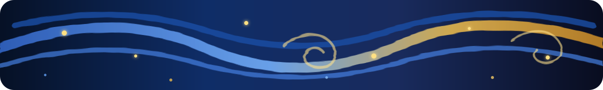
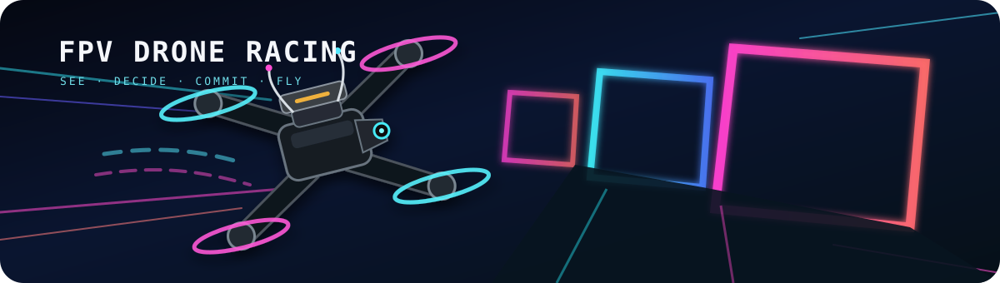

### ✈️ Aerospace Engineering @ UNNC

一个还在寻找方向、但一直在动手探索的迷茫青年。  
喜欢让机器 **飞起来、动起来，也学会自己做决定**。

[**中文**](./README.md) · [**English**](./README_EN.md)

---

## 🧭 About me

我就读于 **宁波诺丁汉大学（University of Nottingham Ningbo China）航空航天专业**。  
同时，我也是 [**UNNC Control Systems Lab · 宁波诺丁汉大学控制系统实验室**](https://github.com/ControlSystemLab-UNNC) 的科研人员，参与机器人、控制与自主系统相关方向的探索与研发。

我还没有完全想清楚未来最终会走向哪里。  
但目前，我很希望能把脑海里的想法变成代码、仿真、机器人和真正能飞起来的东西。

我正在探索这些方向：

<table>
<tr>
<td width="50%" valign="top">

### 🏁 [Drone Racing](https://github.com/ssybh2/isaac_drone_racer)

高速自主飞行、视觉感知、状态估计与策略学习。  
让无人机在极限状态下“看见、判断、穿过去”。

</td>
<td width="50%" valign="top">

### 🧠 [强化学习 · Reinforcement Learning](https://github.com/ssybh2/isaac_drone_racer)

尝试让机器人从规则之外，通过交互与试错学会更好的行为。  
目前主要把它用在无人机与机器人控制上。

</td>
</tr>

<tr>
<td width="50%" valign="top">

### 🤖 [具身智能 · Embodied Intelligence](https://github.com/ssybh2/Micro_to_Macro)

我对“智能如何控制复杂躯体”很感兴趣。  
通过强化学习实现机器人的控制，简化撰写传统控制器过程。

</td>
<td width="50%" valign="top">

### 🚁 [无人机研发 · UAV R&D](https://github.com/ssybh2/soft_drone_controller)

从飞控、控制器到硬件与系统集成，慢慢把一架无人机从零搭起来。  
这是梦开始的地方。

</td>
</tr>
</table>

---

### 🧰 Things I play with

不想把这里变成一份简历，只放一些我经常拿来“造东西”的工具。

---

### 🏁 Drone Racing

竞速穿越机不是“普通四旋翼”——它更像是在速度、视觉和控制极限之间不断做选择。

---

### 🌌 Still exploring.

也许未来还没有一个标准答案。  
那就先继续学习、继续造东西、继续飞。

**Keep exploring · Keep building · Keep flying**

